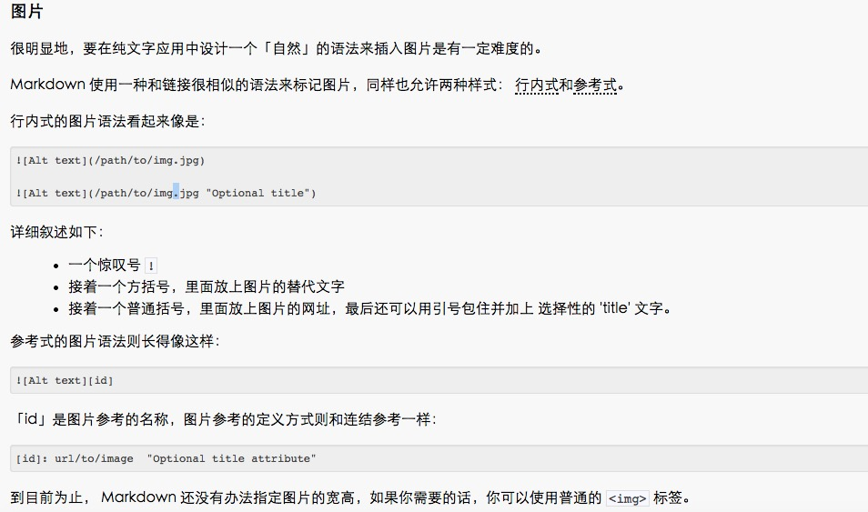

# markdown-info

标题

类 Atx 形式:在行首插入 1 到 6 个 # 对应到标题 1 到 6 阶
# 这是h1
## 这是h2
#### 这是h4
###### 这是h6

列表

无序列表使用星号、加号或是减号作为列表标记

* white
* blue
* red

有序列表则使用数字接着一个英文句点

1. qq
2. ww
3. ee

图片

行内式：一个惊叹号 ! 
接着一个方括号，里面放上图片的替代文字
接着一个普通括号，里面放上图片的网址，最后还可以用引号包住并加上 选择性的 'title' 文字



html标签式：

 

代码

标记一小段行内代码，你可以用反引号把它包起来（`）

```function（）{}```